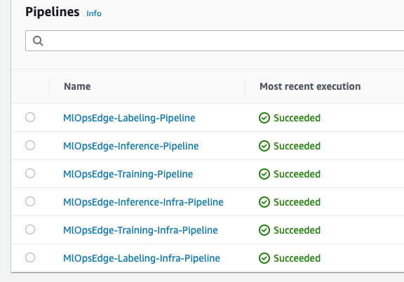
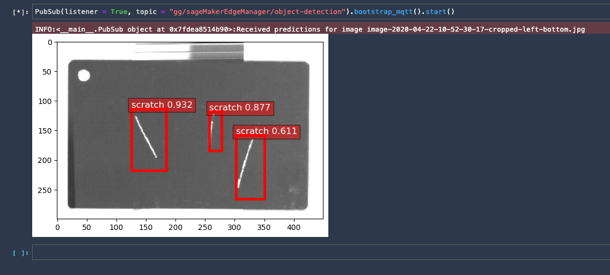
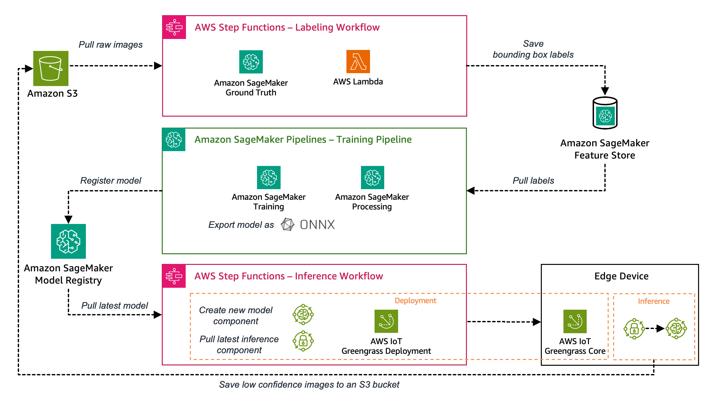

# End-to-End MLOps Example for visual quality inspection at the edge using Amazon SageMaker, AWS Greengrass, AWS CodePipeline and AWS CDK 

This is a sample implementation for an end-to-end MLOps pipeline for quality inspection at the edge based on Amazon SageMaker and AWS Greengrass. The focus is to provide an end-to-end example including following components:

- [Labeling](./labeling/) - Automated labeling of the images using SageMaker Ground Truth
- [Training](./training/) - Training and evaluation of the bounding box detection model using Amazon SageMaker
- [Inference](./inference/) - Compilation, Packaging and Deployment of the model to an edge device for inference running AWS Greengrass.

Deployment of each of these pipeline components is fully automated using AWS CodePipeline and AWS CDK. Each component is implemented as separate CDK app and pipeline in AWS CodePipeline. This allows deploying Labeling, Training and Inference separately in case you want to dive deeper into each of these aspects individually.

## Pre-requisite


Before installing this sample, make sure you have following installed:

1. [AWS CLI](https://aws.amazon.com/cli/)  
2. [Docker](https://docs.docker.com/get-docker/) 
3. [NodeJS](https://nodejs.org/en/) 
4. [AWS CDK v2](https://docs.aws.amazon.com/cdk/v2/guide/getting_started.html#getting_started_install) 
5. [Configure your AWS CLI](https://docs.aws.amazon.com/cli/latest/userguide/cli-configure-quickstart.html) 
6. [Bootstrap AWS CDK in your target account](https://docs.aws.amazon.com/cdk/v2/guide/getting_started.html#getting_started_bootstrap) 

### Choose your source Repo

#### Option 1: Use GitHub Repo

1. Fork this repo in your GitHub account
1. [Create a GitHub connection using the CodePipeline console](https://docs.aws.amazon.com/codepipeline/latest/userguide/connections-github.html) to provide CodePipeline with access to your GitHub repositories *(See section Create a connection to GitHub (CLI))* 
1. Update the GitHub related configuration in the `./repo_config.yaml` file
    * Set the value of *repoType* to `GITHUB`
    * Update the value of *githubConnectionArn*, *githubRepoOwner* and *repoName*
1. Commit and push the changed file to your fork

#### Option 2: Create a CodeCommit Repo in your AWS account

Alternatively, the CDK Infrastructure code can provision a CodeCommit Repo as Source Repo for you. 

To choose this option, set the value of *repoType* to `CODECOMMIT` in the `./repo_config.yaml` file.

## Boostrap your account
This repo uses the AWS Cloud Development Kit (AWS CDK) v2. AWS CDK requires you to bootstrap your AWS account before deploying with CDK (see [Bootstrapping](https://docs.aws.amazon.com/cdk/v2/guide/bootstrapping.html) in the AWS CDK documentation).
Either follow the steps described in the manual our run `make bootstrap-cdk` to boostrap your AWS account.

## Quick start

After completing the Prerequisites just run 

```
make deploy
```

to deploy the full solution!

Note: full deployment can take more than 20 minutes depending on your internet connection. CDK is using Docker and needs to download build images the first time you run it.

## Validating the sample deployment

Once deployment is finished open the AWS CodePipeline console to validate your CodePipelines. Once all Codepipelines finished deploying, your console should look like this:



Note: On first deployment, full deployment of all pipelines takes about 1 hour. 

### Validating inference

The greengrass device runs inference on a set of sample images to simulate the camera and publishes results every 5 seconds to an MQTT topic. The quickest way to validate this is to use the MQTT client in the AWS console:

1. Open the [MQTT client](https://console.aws.amazon.com/iot/home#/test)
2. In the topic filter type: `qualityinspection/scratch-detection` and hit the `Subscribe` button
3. You should see an output like below after about 5 seconds:

```
{
  "timestamp": "2022-09-02 07:20:14.861283+00:00",
  "image_name": "image-2020-04-22-10-51-26-67-cropped-right-top.jpg",
  "inference_results": [
    [
      [
        0,
        0,
        0
      ],
      [
        0.8552689552307129,
        0.7992166876792908,
        0.6160680055618286
      ],
      [
        [
          274.1676025390625,
          117.75273895263672,
          295.042236328125,
          187.58438110351562
        ],
        [
          141.7375946044922,
          117.36134338378906,
          202.3010711669922,
          215.0024871826172
        ],
        [
          327.2494812011719,
          167.72132873535156,
          359.4731140136719,
          260.1994323730469
        ]
      ]
    ]
  ]
}
```
The inference results has 3 arrays:

- the class detected (in our case 0 equals scratch)
- the probability from 0 to 1
- bounding box coordinates (absolute coordinates)

### Visualizing inference

You can also visualize the inferences done by the greengrass device using a [jupyter notebook](notebooks/Test-Inference.ipynb). 
For executing the notebook you need a notebook environment like [SageMaker Studio](https://docs.aws.amazon.com/sagemaker/latest/dg/onboard-quick-start.html). Follow these steps to test the inference using a notebook:

- [Configure and Open SageMaker Studio](https://docs.aws.amazon.com/sagemaker/latest/dg/onboard-quick-start.html)
- Open a terminal
- Clone this repository and open [the notebook notebooks/Test-Inference.ipynb](notebooks/Test-Inference.ipynb)
- At the top select `Run - Run all cells`
- Once execution finishes it should visualise incoming inferences at the bottom like this:




## Overall Architecture

This is the architecture overview for the quality inspection MLOps pipeline showing the high level components and services used:



If you want to dive deeper into each component, check out the relevant Readme files:

- [Labeling](./labeling/) - Automated labeling of the images using SageMaker Ground Truth
- [Training](./training/) - Training and evaluation of the bounding box detection model using Amazon SageMaker
- [Inference](./inference/) - Compilation, Packaging and Deployment of the model to an edge device for inference running AWS Greengrass.
- [MLOps infrastructure](./init/) - Provides the MLOps infrastructure needed like SageMaker Feature Store, SageMaker Model Registry  and S3 Bucket


## Project Layout

- doc - documentation artifacts
- [inference](./inference/) - cdk app to deploy all artifacts related to edge deployment
- [init](./init/) - cdk app to deploy MLOps infrastucture like S3 bucket, SageMaker Model Registry Model Group or SageMaker Feature Store Feature Group
- [labeling](./labeling/) - cdk app to deploy all artifacts related to data labeling
- notebooks - utility notebooks to test inference or browse SageMaker feature store
- [training](./training/) - cdk app to deploy all artifacts related to model building and training


## Cost and Cleanup

Important: this application uses various AWS services and there are costs associated with these services after the Free Tier usage - please see the AWS Pricing page for details. Depending on how often you run the pipeline costs may vary. However with standard usage (2 pipeline runs per day), cost will be below 5 dollars per day beyond free tier. 

Run `make destroy` to cleanup all related resources in your account. 

## Security
This application was written for demonstration and educational purposes and not for production use. The [Security Pillar of the AWS Well-Architected Framework](https://docs.aws.amazon.com/wellarchitected/latest/security-pillar/welcome.html)
can support you in further adopting the sample into a production deployment in addition to your own established processes. In particular, take note of the following:

- AWS CodeBuild jobs use default encryption settings: https://docs.aws.amazon.com/codebuild/latest/userguide/security-encryption.html
- AWS CodeBuild jobs may run in privileged mode: https://docs.aws.amazon.com/codebuild/latest/userguide/sample-docker.html
- There are AWS managed policies and other policies in use that may contain wildcards. Please scope down the permissions as per your individual requirements.

## License

This library is licensed under the MIT-0 License. See the LICENSE file.

**3rd party licences (see THIRD_PARTY_LICENSES):**  
This package depends on and may incorporate or retrieve a number of third-party
software packages (such as open source packages) at install-time or build-time
or run-time ("External Dependencies"). The External Dependencies are subject to
license terms that you must accept in order to use this package. If you do not
accept all of the applicable license terms, you should not use this package. We
recommend that you consult your company’s open source approval policy before
proceeding.

Provided below is a list of External Dependencies and the applicable license
identification as indicated by the documentation associated with the External
Dependencies as of Amazon's most recent review.

THIS INFORMATION IS PROVIDED FOR CONVENIENCE ONLY. AMAZON DOES NOT PROMISE THAT
THE LIST OR THE APPLICABLE TERMS AND CONDITIONS ARE COMPLETE, ACCURATE, OR
UP-TO-DATE, AND AMAZON WILL HAVE NO LIABILITY FOR ANY INACCURACIES. YOU SHOULD
CONSULT THE DOWNLOAD SITES FOR THE EXTERNAL DEPENDENCIES FOR THE MOST COMPLETE
AND UP-TO-DATE LICENSING INFORMATION.

YOUR USE OF THE EXTERNAL DEPENDENCIES IS AT YOUR SOLE RISK. IN NO EVENT WILL
AMAZON BE LIABLE FOR ANY DAMAGES, INCLUDING WITHOUT LIMITATION ANY DIRECT,
INDIRECT, CONSEQUENTIAL, SPECIAL, INCIDENTAL, OR PUNITIVE DAMAGES (INCLUDING
FOR ANY LOSS OF GOODWILL, BUSINESS INTERRUPTION, LOST PROFITS OR DATA, OR
COMPUTER FAILURE OR MALFUNCTION) ARISING FROM OR RELATING TO THE EXTERNAL
DEPENDENCIES, HOWEVER CAUSED AND REGARDLESS OF THE THEORY OF LIABILITY, EVEN
IF AMAZON HAS BEEN ADVISED OF THE POSSIBILITY OF SUCH DAMAGES. THESE LIMITATIONS
AND DISCLAIMERS APPLY EXCEPT TO THE EXTENT PROHIBITED BY APPLICABLE LAW.

**Ultralytics YOLOv8 - https://github.com/ultralytics/ultralytics - AGPL-3.0 license**

## Contributing

Refer to [CONTRIBUTING](./CONTRIBUTING.md) for more details on how to contribute to this project.

## Security

See [CONTRIBUTING](CONTRIBUTING.md#security-issue-notifications) for more information.
