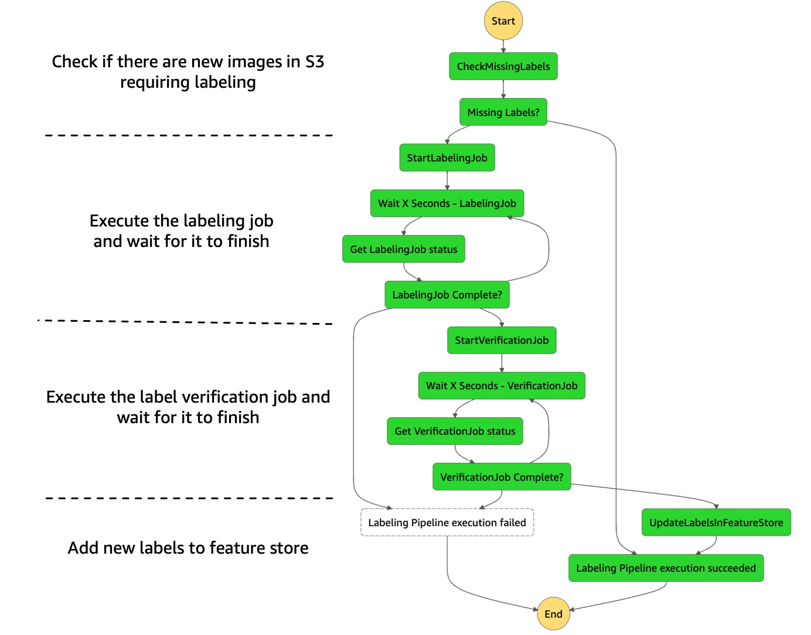
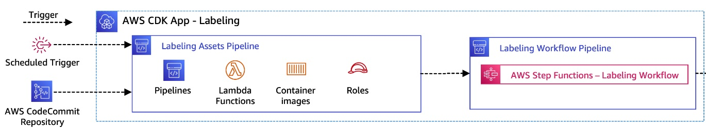

# Labeling 

This folder contains the cdk app which deploys the labeling part of the MLOps pipeline. As part of this images woith missing labels are [annotated using using bounding boxes via SageMaker Ground Truth](https://docs.aws.amazon.com/sagemaker/latest/dg/sms-bounding-box.html). Labeling is orchestrated using a AWS StepFunctions workflow. The step functions workflow follows following high level steps:

1. Get a list of raw images in S3 and check in Amazon SageMaker Feature store which images have missing labels 
2. Kickoff a labeling job in SageMaker Ground Truth to label remaining images 
3. After the labeling job is finished kick of a label verification job in SageMaker Ground Truth 
4. Write the verified labels to feature store 

Each of these steps are implemented using lambda functions. Simple wait/satus check loops are implemented to check the status of the Ground Truth job. This is how the final StepFunctions workflow looks like in detail:


### CI/CD pipeline

In order for the StepFunctions workflow to run succesfully a number of assets like lambda functions and iam roles need to be deployed beforehand. This deployment is automated using a CDK app. The pipeline is triggered on a schedule as well as on git commit using two pipelines in AWS CodePipeline. This is how the architecture of the CI/CD infrastructure looks like deployed by the CDK app:



Note the CodePipeline deployed here is a self-mutating pipeline which updates itself during the run. It is deployed using [CDK pipelines](https://docs.aws.amazon.com/cdk/api/v2/docs/aws-cdk-lib.pipelines-readme.html). Checkout [this blog](https://aws.amazon.com/blogs/developer/cdk-pipelines-continuous-delivery-for-aws-cdk-applications/) if you want an intro to CDK pipelines

### repository layout

This is the layout of the labeling CDK app:

```bash
├── bin                           
    ├── app.ts                              - cdk app definition
├── lib     
    ├── constructs
    │   └── labeling-pipeline-assets.ts     - construct which deploys required pipeline assets (lambdas, roles )
    ├── lambda
    │   ├── check_missing_labels            - lambda to check for missing labels in s3/feature store
    │   ├── run_labeling_job                - lambda to create required inputs and kickoff labeling job
    │   ├── run_verification_job            - lambda to create required inputs and kickoff verification job
    │   └── update_feature_store            - lambda which updates feature store based on output of verification job
    ├── stacks
    │   ├── labeling-pipeline.ts            - stack to define the cicd pipeline for labeling
    │   └── statemachine-pipeline.ts        - stack to define the state machine code pipeline
├── Makefile 
├── config.yaml                             - pipeline config, changes to the labeling workflow are done here
├── package.json                            - node dependency definition
```

### Changing configuration

You can change the behaviour of the labeling pipeline by changing the values in in [config.yaml](config.yaml). Checkout the file to learn more about properties you can change.